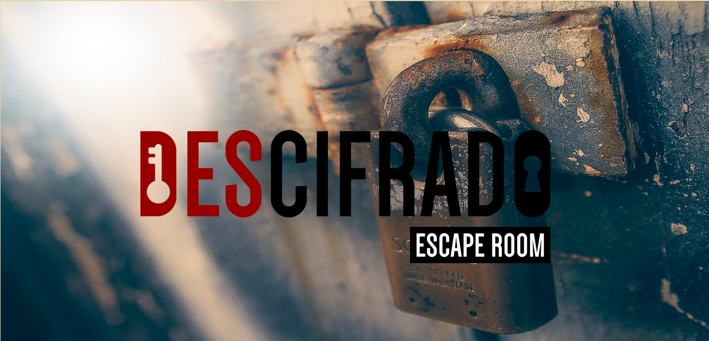

# Descifrado Escape Room
Ambientado en una sala de escape, los participantes serán encerrados en una habitación donde la misión es resolver un acertijo. El funcionamiento del mismo es muy sencillo, para ello deben tener en cuenta la respuesta ya cifrada como referencia, de este modo conseguir el número de espacios que la palabra ha sido desplazada. El número de desplazamientos es el código que abre el candado de la habitación.

### Usuarios y objetivos en relación con el producto
El producto está enfocado en las salas de escape donde por lo general la misión es resolver el misterio que rodea a una historia, para ello deben solucionar diversos enigmas, rompecabezas, encontrar llaves ocultas, abrir puertas, cajones y descifrar acertijos como en este caso, solo que usando tecnología debido a que el público objetivo son adultos entre 18 y 40 años.

### Aplicando Cifrado Cesar
Al desarrollar código Cifrado Cesar en una aplicación web, facilita la interacción entre los usuarios y el juego, específicamente al momento de cifrar la respuesta y descubrir el número de espacios que la misma habría sido desplazada, imprescindible para la liberación de los participantes de la habitación.

### Prototipado
El diseño inicial lucía más como un formulario, sin embargo luego de pedir feedback y al ser una sala de escape, el color amarillo que coloqué al inicio resultaba ser un color demasiado llamativo para el ambiente en el cual se iba a desarrollar este proyecto. También resaltó el detalle que resultaba bastante complejo explicar la dinámica del acertijo y el cifrado como eje central del proyecto, además de la cantidad de preguntas.

Durante el proceso de construcción del proyecto el diseño tuvo dos cambios puntuales:

- Los colores: Al inicio se consideró usar colores llamativos, sin tener en cuenta la atmosfera en la cual el proyecto se iba a desenvolver.

- Cantidad de preguntas: Por ser un juego dentro de otras actividades (varias habitaciones con diferentes misiones) se consideró trabajar en solo una pregunta.

